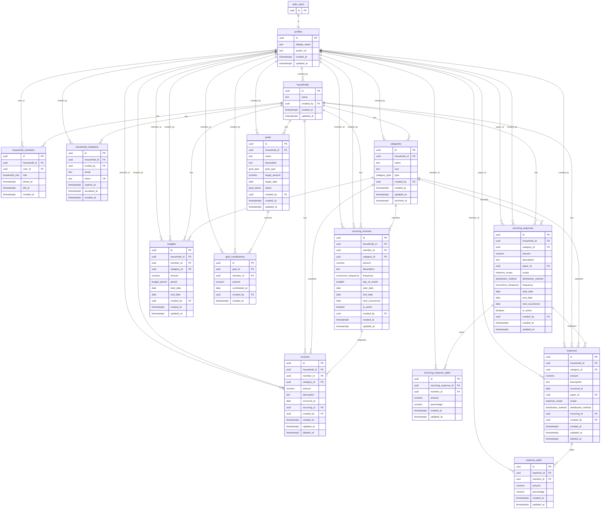

# Nido entity-relationship diagram

This diagram matches the foundation schema in `supabase/migrations/20260816000000_nido_foundation_schema.sql`.

`auth.users` is shown as `auth_users`. It already exists in Supabase and is not created by the migration.

## Relationship notes

- A user has at most one **active** household membership (`left_at IS NULL`). Historical memberships are many. Financial FKs point at `profiles`, not at `household_members`, so leaving does not delete history.
- `member_id` / `payer_id` + `household_id` keep a transaction in its original Nido after the person joins another Nido.
- `budgets.member_id` is optional: null is a Nido-level budget.
- `incomes.recurring_id` and `expenses.recurring_id` are optional. When set, the rule must belong to the same household (and the same member for income). Confirmed transactions can exist without a template.
- Recurring rules are templates. `next_occurrence` is the only scheduling cursor. There is no occurrence table.
- `expense_splits` and `recurring_expense_splits` list participants only. The payer is stored on the parent expense / rule and does not have to appear in the split set.
- Personal and shared expenses use the same `expenses` + `expense_splits` model.
- For `income_based` recurring expenses, shares are recalculated at generation time. Confirmed `expense_splits` are historical and are not recalculated when income changes.
- There is no `balances` table. There is no `current_amount` on goals and no `current_spent` on budgets.
- There is no `currency` column. One implicit household currency for this version.
